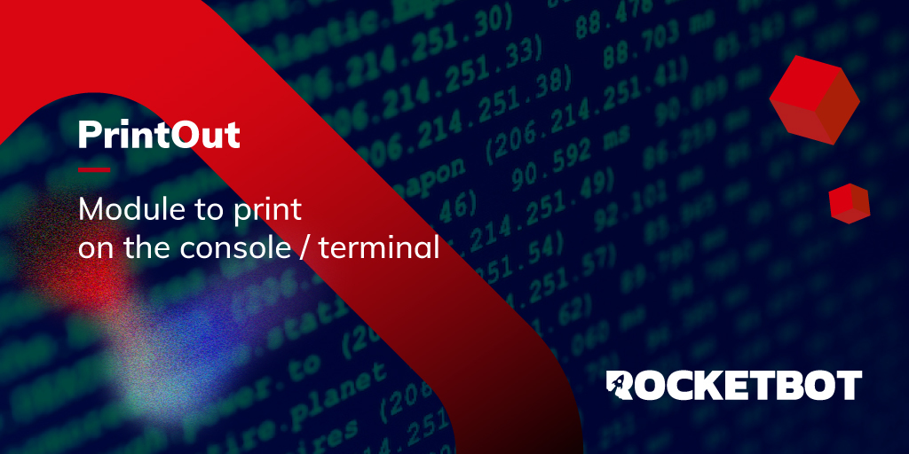

# PrintOut
  
Módulo para imprimir en Consola  
  

## Como instalar este módulo
  
__Descarga__ e __instala__ el contenido en la carpeta 'modules' en la ruta de Rocketbot.  

## Descripción de los comandos

### Imprimir en consola
  
Imprimir information en la consola
|Parámetros|Descripción|ejemplo|
| --- | --- | --- |
|Text to print||Text|
|Decorator||*|
|Color||-----Select Color-----|
